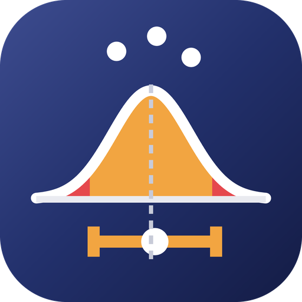

# Inferencia Estadística

> App móvil educativa universitaria para aprender **inferencia estadística mediante simulaciones**:
> muestreo, distribuciones muestrales, intervalos de confianza y pruebas de hipótesis.
> Flutter · Dart · Riverpod · sin conexión · lista para GitHub Actions y APK.

<p align="center">
  
</p>

---

## Por qué existe

Toda la inferencia descansa en una frase que los estudiantes memorizan sin verla nunca:
*«si repitiera el muestreo muchas veces…»*. Ese experimento imaginario es el origen del
error estándar, del 95 % de confianza y del p-valor. Sin verlo, la inferencia se reduce a
aplicar fórmulas y a repetir «si p < 0,05, rechazo».

Esta app hace visible ese experimento: el estudiante extrae miles de muestras, construye cien
intervalos y simula el mundo en el que H₀ es cierta. Después decide sobre casos profesionales
reales de once carreras y asume el riesgo de su decisión.

## Qué la diferencia

| Decisión de producto | Qué resuelve |
|---|---|
| **Predice → Simula → Explica** en los 14 experimentos | El estudiante se compromete con una intuición antes de ver el resultado; la conclusión permanece bloqueada hasta haber simulado lo suficiente. |
| **Cada distractor declara su confusión** (30 catalogadas) | La app no dice «incorrecto»: nombra *qué* idea equivocada produce ese error y ofrece el experimento o la lección que la corrige. |
| **Regla 60/40 y «acierto ciego»** | En los ejercicios de decisión, elegir bien vale 0,6 y el porqué 0,4. Acertar sin la razón correcta se mide y se reporta. |
| **La calculadora inferencial siempre disponible** | Si el problema es interpretar, evaluar aritmética es evaluar lo que el estudiante ya sabe hacer. |
| **Casos profesionales de 11 carreras** | Minas, Ambiental, Sistemas, Electrónica, Administración, Economía, Contabilidad, Psicología, Biología, Humanidades y Desarrollo personal. |
| **Test de cifras del contenido** | Cada número afirmado en un enunciado se recalcula con el motor estadístico en CI: editar un dato no puede dejar falso un texto. |

## Contenido incluido

| Elemento | Cantidad |
|---|---|
| Módulos | 5 (Población y muestra · Distribución muestral · Intervalos · Pruebas · Decisiones) |
| Lecciones / tarjetas | 20 / 97 |
| Laboratorios / experimentos | 5 / 14 |
| Ejercicios (5 tipos) | 50, con retroalimentación propia por alternativa |
| Casos profesionales | 11, de 11 carreras |
| Confusiones catalogadas | 30, todas producidas por algún distractor |
| Glosario | 43 términos |
| Cifras verificadas contra el motor | 50 |
| Archivos Dart / líneas | 88 / ~11 400 |
| Suites de pruebas | 9 |

## Estructura

```
inferencia_estadistica/
├── lib/
│   ├── core/            tema, formato español, widgets comunes, marca
│   ├── domain/          Dart puro: estadística, simulación, modelos, motores
│   ├── data/            lectura de contenido (JSON) y persistencia local
│   └── presentation/    providers, gráficos (CustomPainter), pantallas, laboratorios
├── assets/
│   ├── content/         todo el contenido educativo, declarativo en JSON
│   └── icon/            icono generado por tool/generate_icon.py
├── test/                8 suites: motor, simulación, contenido, cifras, UI
├── tool/                validador de contenido, réplica Python del motor,
│                        verificación estática, generador de icono, firma
├── docs/                análisis de producto, arquitectura, despliegue, calidad
└── .github/workflows/   CI (análisis + pruebas) y compilación de APK
```

## Ejecutar el proyecto

```bash
# 1. Generar las plataformas nativas (no sobrescribe lo versionado)
flutter create --platforms=android,ios --project-name inferencia_estadistica --org com.inferenciaestadistica .
bash tool/postcreate.sh

# 2. Dependencias e icono
flutter pub get
dart run flutter_launcher_icons

# 3. Verificar y ejecutar
python3 tool/validate_content.py     # integridad y cifras del contenido
flutter analyze --no-fatal-infos
flutter test
flutter run
```

APK de release:

```bash
flutter build apk --release              # universal
flutter build apk --release --split-per-abi
```

## CI/CD

| Workflow | Cuándo | Qué hace |
|---|---|---|
| `ci.yml` | push a `main`/`develop`, PR | Valida contenido y cifras (Python), verificación estática, `flutter analyze` y `flutter test`. |
| `build-apk.yml` | push a `main`, etiquetas `v*`, manual | Compila APK universal y por arquitectura, los sube como artefacto y publica un release en etiquetas `v*`. |
| `build-ios.yml` | manual | Compila para iOS sin firma, para comprobar que el proyecto está sano. |

Sin secretos de firma, el APK de release se firma con la clave de depuración: es **instalable
para pruebas de campo**, no publicable en Google Play. Para la firma real, ver
[`docs/05_Despliegue_y_CI_CD.md`](docs/05_Despliegue_y_CI_CD.md).

## Documentación

| Documento | Contenido |
|---|---|
| [`docs/00_Analisis_de_Producto.md`](docs/00_Analisis_de_Producto.md) | Las 13 dimensiones del análisis educativo. |
| [`docs/01_Validacion_Academica.md`](docs/01_Validacion_Academica.md) | Cursos, temas, dificultades documentadas y mapa de contenidos. |
| [`docs/02_Diseno_de_Experiencia.md`](docs/02_Diseno_de_Experiencia.md) | Flujos, tipos de ejercicio, laboratorios, identidad visual. |
| [`docs/03_Especificacion_MVP.md`](docs/03_Especificacion_MVP.md) | Alcance, criterios de aceptación, lo que queda fuera. |
| [`docs/04_Arquitectura_Tecnica.md`](docs/04_Arquitectura_Tecnica.md) | Capas, modelo de datos, motores, decisión sobre IA. |
| [`docs/05_Despliegue_y_CI_CD.md`](docs/05_Despliegue_y_CI_CD.md) | GitHub, workflows, APK, firma, publicación. |
| [`docs/06_Pruebas_y_Calidad.md`](docs/06_Pruebas_y_Calidad.md) | Estrategia de pruebas y qué protege cada suite. |
| [`docs/07_Guia_de_Contenido.md`](docs/07_Guia_de_Contenido.md) | Cómo añadir lecciones, ejercicios y casos sin romper nada. |

## Estado

Versión 1.0.0 (MVP). El proyecto se construyó **sin SDK de Flutter en el entorno de
desarrollo** (red restringida), de modo que la primera compilación ocurre en CI. La
verificación previa incluye: validación de contenido y de 50 cifras contra la réplica en
Python del motor (cruzada con SciPy), y verificación estática de los 88 archivos Dart
(balance de delimitadores, imports resueltos y usados, clases del proyecto importadas).

---

*Parte de **Educational Mobile Apps Factory** — biblioteca de aplicaciones educativas
universitarias. Sin conexión, sin cuentas, sin analítica: el progreso vive solo en el
dispositivo del estudiante.*
